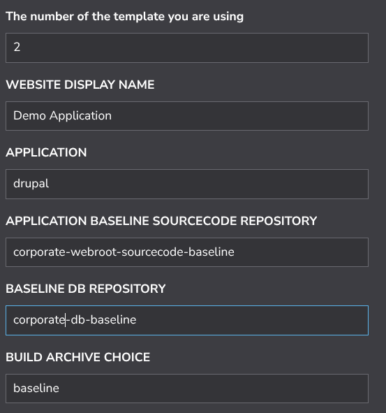
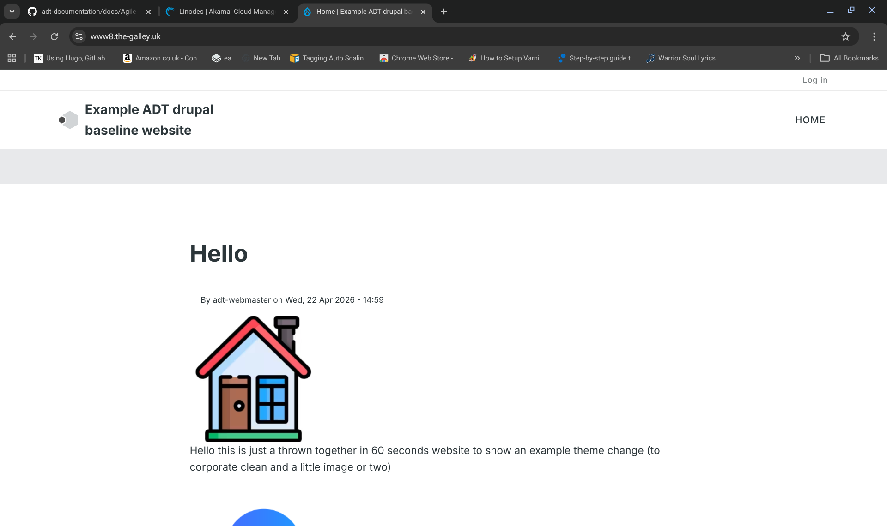

#### MANDATORY PRE-REQUISITE STEPS (NEEDED BY ALL DEMOS BELOW)  

Perform step 1 or 2 below according to your experience and apply the overrides to your StackScript as described below for your desired demo type before you click "Create Linode"

1. If you are a beginner, follow [here](./QuickStartDemosPrepBeginnerLevel.md)  
2. If you are an expert, follow [here](./QuickStartDemosPrepExpertLevel.md)

-------------------------

#### QUICK DEMO EXAMPLES

Once you have performed the mandatory steps above you can action specific demos by overriding the mentioned settings in the StackScript before you deploy it. By overriding different settings as described below, you will deploy different application types using the same StackScript.  

### Demo 1 (Corporate template installed from a baseline)

   

The Default username is "adt-webmaster" and the default password is the "ISGYNS2RXBR0"

 

