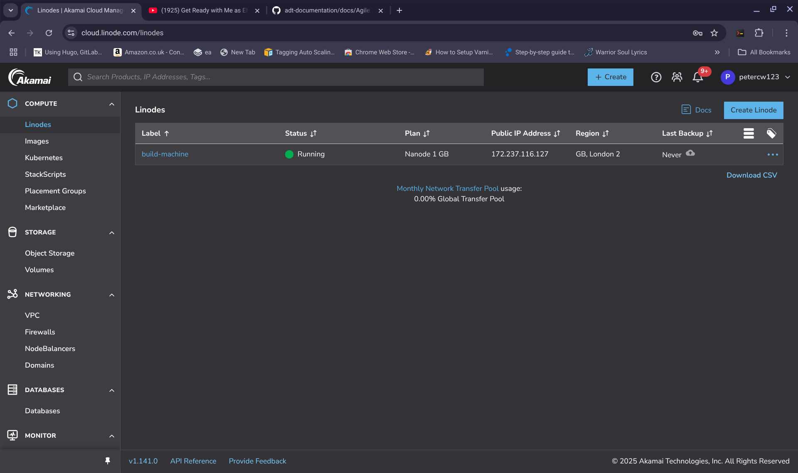

## FURTHER QUICK DEMOS

If you like the demo below and you want to try further demos other than our default one click [HERE](./CustomisedDemos.md). 
You might want to reference [Understanding StackScript overrides](./ExampleStackScriptOverride.md)

--------------------

## QUICK-START DEMO  

**NOTE:** This quick start demo is only intended for use on the Linode platform using the supplied [StackScript](https://cloud.linode.com/stackscripts/635271) to demonstrate example usage cases for the Agile Deployment Toolkit as quickly and easily as possible.  The demos themselves are very quickly put together simply there for illustrative purposes they are not there to provide any truly useful function. If anyone would like to spend time crafting demos useful for real function that could be listed here that would be valued. 

The purpose of these quick start demos is to show you that with just some parameters you can achieve a lot using the Agile Deployment Toolkit with the possibility of going much deeper into it if you choose to.

For more information about parameter configuration please see the [spec](https://github.com/wintersys-dev/adt-build-machine-scripts/blob/main/templatedconfigurations/specification.md) and [quickspec](https://github.com/wintersys-dev/adt-build-machine-scripts/blob/main/templatedconfigurations/quick_specification.dat)

**NOTE:** The onus of these demos is on the word "Quick" and what I mean by that is that throughout these demos I suggest using security keys and tokens which have "full access rights" for all function of your account and therefore can be generated once and reused across all function rather than "limited access keys" which can only be used for particular function according to their scoping. Obviously this is not the most secure approach and if you were doing processes similar to this for real you would want to follow the "principle of least privileges" meaning that you would generate key sets for specific function within your account and with limited access rights.   

**NOTE2:** The first time you deploy these demos to a specific domain name an SSL certificate will be generated for that domain which can take some time. If you make subsequent deployments if you use the same domain name for separate deployments the certificates previously issued will be reused and the time take for the deployment to be made will be sped up. If you choose a different domain name, then, a new certificate will be generated for that specific domain which will cause the deployment to take longer. 

**NOTE3:** A copy of the credentials when you are making a virgin CMS deployment can be found by running 

>     ${BUILD_HOME}/ApplicationCredentials.sh

on your build machine.

------------------------------

## MANDATORY INITIAL CONFIGURATION STEPS

THIS WILL INSTALL THE DEFAULT DEMO  

1. If you are a beginner, follow [here](./QuickStartDemosPrepBeginnerLevel.md)  
2. If you are an expert (most techies), follow [here](./QuickStartDemosPrepExpertLevel.md)

-------------------------------

DO NOT PASS HERE IF YOU HAVEN'T SUCCESSFULLY COMPLETED EITHER STEP 1 (beginner) **OR** STEP2 (expert) ACCORDING TO YOUR EXPERIENCE

Once you clicked "**Create Linode**" at the end of process 1 or 2 above, the default demo (an application built with Joomla and Community Builder) will deploy.

Once the build is completed (or earlier if you like, once the build machine is pingable) you can get the IP address of your build machine through the Linode GUI system (in my case: 172.237.116.127)

You can ssh onto your build machine with

>      ssh -p <build-machine-port> <username>@<build-machine-ip>
>      for example in my case this is: ssh -p 1035 agile-deployer@172.237.116.127

then do a

>      sudo su
>      <password> (as per the value you entered for 'The password for your build machine user (required)' into the StackScript and stored in your ~/adt-credentials.txt file)
>      cd adt-build-machine-scripts
>      ./Logs.sh

-----------------

## DEPLOYING THESE DEMOS USING CLOUD-INIT 

With the slight modification of following the step that says "Quick Demo" or "if you are making Quick Demo deployment" you can achieve the same thing as you have achieved using a StackScript but with a "UserData" or "Cloud Init" script instead. UserData scripts have the disadvantage of being more complex to look at but the advantage of being platform independent. 

[DigitalOcean](../Tutorials/digitalocean/build-machine.md)  
[Exoscale](../Tutorials/exoscale/build-machine.md)  
[Linode](../Tutorials/linode/build-machine.md)  
[Vultr](../Tutorials/vultr/build-machine.md)  

