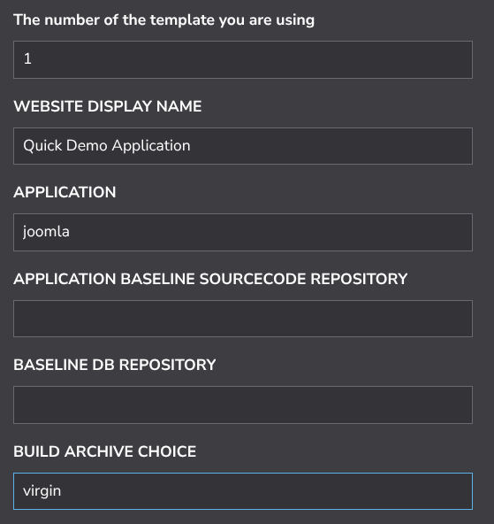
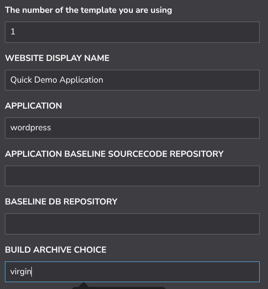
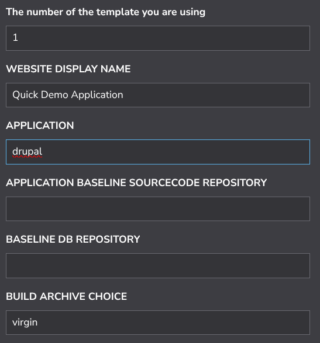
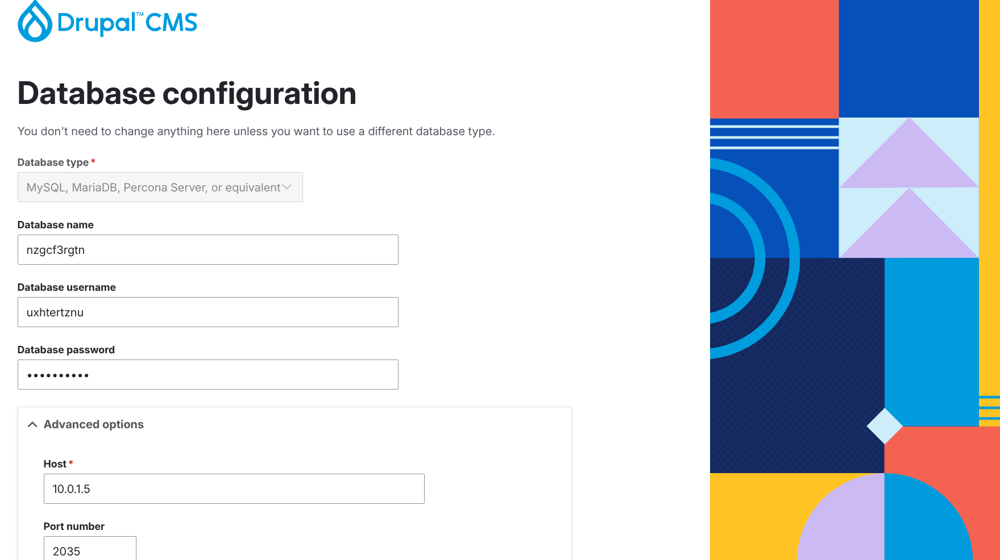
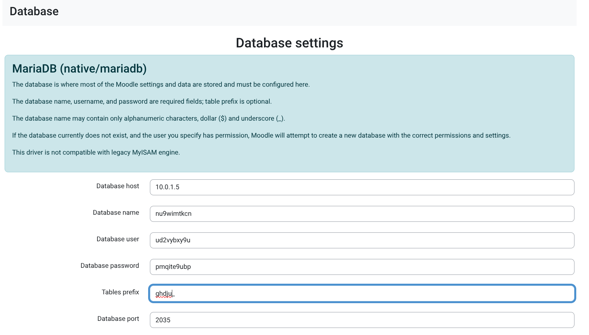

### MANDATORY PRE-REQUISITE STEPS (NEEDED BY ALL DEMOS BELOW)

Perform step 1 or 2 below according to your experience and apply the overrides to your StackScript as described below for your desired demo type before you click "Create Linode"

1. If you are a beginner, follow [here](./QuickStartDemosPrepBeginnerLevel.md)  
2. If you are an expert, follow [here](./QuickStartDemosPrepExpertLevel.md)

-------------------------  

### QUICK DEMO OVERRIDE EXAMPLES

Once you have performed the mandatory steps above you can action specific demos by overriding the mentioned settings in the StackScript before you deploy it. By overriding different settings as described below, you will deploy different application types using the same StackScript. 

### Demo 1 (StackScript overrides for a virgin installation of the Joomla CMS)  

Set these fields of your StackScript as shown to deploy a copy of Joomla. The rest of the "Advanced Settings" can be set with their default values. You will need to set password, vpc, firewall and so on at the bottom of the script before you click "Create Linode". 

 

Go to the URL of your virgin Joomla installation in my case:

>     https://www.nuocial.uk

The Default username is "adt-webmaster" and the default password is the "first 12 characters of the value of your Object Storage Access Key"

---------------------------

### Demo 2 (StackScript overrides for a virgin installation of the Wordpress CMS)   

Set these fields of your StackScript as shown to deploy a copy of Wordpress. The rest of the "Advanced Settings" can be set with their default values. You will need to set password, vpc, firewall and so on at the bottom of the script before you click "Create Linode". 

 

Go to the URL of your virgin Wordpress installation in my case:

>     https://www.nuocial.uk

The Default username is "adt-webmaster" and the default password is the "first 12 characters of the value of your Object Storage Access Key"

---------------------------

### Demo 3 (StackScript overrides for a virgin installation of Drupal) 

Set these fields of your StackScript as shown to deploy a copy of Drupal. The rest of the "Advanced Settings" can be set with their default values. You will need to set password, vpc, firewall and so on at the bottom of the script before you click "Create Linode". 

 

Go to the URL of your virgin Wordpress installation in my case:  

>     https://www.nuocial.uk

The Default username is "adt-webmaster" and the default password is the "first 12 characters of the value of your Object Storage Access Key"

Advanced: 

NOTE: If you are interested in deploying Drupal CMS you need to fork the toolit repsitories and change and alter point the infrastructure repositories to your fork and change the application descriptor for drupal in your fork to deploy drupal CMS

The application descriptor is at ${BUILD_HOME}/application/cms/drupal/descriptor.dat

To deploy drupal CMS you need to follow the exact same steps you just followed for joomla but you need to comment drupal and uncoment drupal cms

**DRUPAL CMS**  

You can install [DRUPAL CMS](https://new.drupal.org/drupal-cms) by making the following alterations to the above DRUPAL (10.0.10) install method  

You can install  by making the modification to the steps above:

>     set "The Display name for your website e.g. My Demo Website" to "My Druapl CMS Demo"  
>     set "APPLICATION BASELINE SOURCECODE REPOSITORY" to "DRUPAL:cms"

To find what to set your application credentials to ssh onto your new build machine sudo to root and cat the application_credentials.dat file that the build generated as shown below

>     ssh -p <build-machine-port> <username>@<build-machine-ip>
>     sudo su
>          <password>
>     /bin/cat /home/<username>/adt-build-machine-scripts/runtimedata/linode/<build-identifier>/credentials/application_credentials.dat

which in my case looks like:

>     ssh -p 1035 agile-deployer@102.12.32.12
>     /bin/cat /home/agile-deployer/adt-build-machine-scripts/runtimedata/linode/test-build/credentials/application_credentials.dat

Go to the URL of your virgin Wordpress installation in my case:

>     https://www.nuocial.uk

and complete the installation of Drupal. When you are putting the credentials you got from application_credentials.dat from your build machine the installation process should look similar to:

  

NOTE: If you get an error message "The website encountered an unexpected error. Try again later" from Drupal CMS once it is installed you need to "clear all caches" which you can do by running

>     ${BUILD_HOME}/helpers/TruncateDrupalCache.sh

on your new build machine.

---------------------------

### Demo 4 (StackScript overrides for a virgin installation of the Moodle CMS)  

>     set "The number (1, 2 or 3) of the template you are using" to "1"  
>     set "WEBSITE DISPLAY NAME" to "My Moodle Demo"  
>     set "APPLICATION" to "moodle"  
>     set "BUILD ARCHIVE CHOICE" to "virgin"  

If you are using the cloud-init method raher than StackScript these you should set

>     export SELECTED_TEMPLATE="1"
>     export WEBSITE_DISPLAY_NAME="My Moodle Demo"
>     export APPLICATION="moodle"
>     export BUILD ARCHIVE CHOICE="virgin"

----------------------

To find what to set your application credentials to ssh onto your new build machine sudo to root and cat the application_credentials.dat file that the build generated as shown below

>     ssh -p <build-machine-port> <username>@<build-machine-ip>
>     sudo su
>          <password>
>     /bin/cat /home/<username>/adt-build-machine-scripts/runtimedata/linode/<build-identifier>/credentials/application_credentials.dat

which in my case looks like:

>     ssh -p 1035 agile-deployer@78.98.32.19
>     /bin/cat /home/agile-deployer/adt-build-machine-scripts/runtimedata/linode/test-build/credentials/application_credentials.dat

Go to the URL of your virgin Moodle installation in my case:

>     https://www.nuocial.uk

and complete the installation of Wordpress. When you are putting the credentials you got from application_credentials.dat from your build machine the installation process should look similar to:

  

---------------------------

### Demo 5 (StackScript overrides for a virgin installation of the Joomla CMS from a baselined repository)  

This is just a sample virgin joomla install there's no sample data or anything it just shows you how you could baseline a virgin joomla installation for maximum ease when making repeated virgin CMS deployments. The advantage to creating a baseline of a virgin installation of a CMS is that you don't have to enter any parameters into the application GUI because the system deals with it all for you and so you can make faster deployments once you have a baseline to build from. The disadvantage is that you have to update the installed CMS from the administrator backend to the latest version because the baseline you made some weeks/months ago will be several releases back from current.

1. Once the application is installed, the username is "webmaster" and the password is "mnbcxz098321QQZZ"

>     set "The number (1, 2 or 3) of the template you are using" to "2"  
>     set "The Display name for your website e.g. My Demo Website" to "My Vanilla Joomla Installation"  
>     set "APPLICATION" to "joomla"  
>     set "BASELINE DB REPOSITORY" to "joomla5.2.5-db-baseline" 
>     set "APPLICATION BASELINE SOURCECODE REPOSITORY" to "joomla5.2.5-webroot-sourcecode-baseline"

If you are using the cloud-init method raher than StackScript these you should set

>     export SELECTED_TEMPLATE="2"
>     export WEBSITE_DISPLAY_NAME="My Vanilla Joomla Installation"
>     export APPLICATION="joomla"
>     export BASELINE DB REPOSITORY="joomla5.2.5-db-baseline"
>     export APPLICATION BASELINE SOURCECODE REPOSITORY="joomla5.2.5-webroot-sourcecode-baseline" 

Wait for the application install to have been completed and available at:

>      https://<dns-url>

-----------------

### Demo 6 (StackScript overrides for a virgin installation of the Wordpress CMS from a baselined repository)  

This is a sample virgin wordpress installation from baselined repositories.  

1. Once the application is installed, the username is "webmaster" and the password is "mnbcxz098321QQZZ"

>     set "The number (1, 2 or 3) of the template you are using" to "2"  
>     set "The Display name for your website e.g. My Demo Website" to "My Vanilla Wordpress Installation"  
>     set "APPLICATION" to "wordpress"  
>     set "BASELINE DB REPOSITORY" to "wordpress6.8.2-db-baseline" 
>     set "APPLICATION BASELINE SOURCECODE REPOSITORY" to "wordpress6.8.2-webroot-sourcecode-baseline"

Wait for the application install to have been completed and available at:

>      https://<dns-url>

-----------------

### Demo 7 (StackScript overrides for a virgin installation of the Drupal CMS from a baselined repository)  

This is a sample virgin drupal installation from baselined repositories.  

1. Once the application is installed, the username is "webmaster" and the password is "mnbcxz098321QQQZZZ"

>     set "The number (1, 2 or 3) of the template you are using" to "2"  
>     set "The Display name for your website e.g. My Demo Website" to "My Vanilla Drupal Installation"  
>     set "APPLICATION" to "drupal"  
>     set "BASELINE DB REPOSITORY" to "drupal11.1.7-db-baseline" 
>     set "APPLICATION BASELINE SOURCECODE REPOSITORY" to "drupal11.1.7-webroot-sourcecode-baseline"

If you are using the cloud-init method raher than StackScript these you should set

>     export SELECTED_TEMPLATE="2"
>     export WEBSITE_DISPLAY_NAME="My Vanilla Drupal Installation"
>     export APPLICATION="drupal"
>     export BASELINE DB REPOSITORY="drupal11.1.7-db-baseline"
>     export APPLICATION BASELINE SOURCECODE REPOSITORY="drupal11.1.7-webroot-sourcecode-baseline" 

Wait for the application install to have been completed and available at:

>      https://<dns-url>

NOTE: If you get an error message "The website encountered an unexpected error. Try again later" from Drupal CMS once it is installed you need to "clear all caches" which you can do by running

>     ${BUILD_HOME}/helpers/TruncateDrupalCache.sh

on your new build machine.

-----------------

### Demo 8 (StackScript overrides for a virgin installation of the Moodle CMS from a baselined repository) 

This is a sample virgin moodle installation from baselined repositories.  

1. Once the application is installed, the username is "webmaster" and the password is "mnbcxz098321QQQZZZ$$"

>     set "The number (1, 2 or 3) of the template you are using" to "2"  
>     set "The Display name for your website e.g. My Demo Website" to "My Vanilla Moodle Installation"  
>     set "APPLICATION" to "moodle"  
>     set "BASELINE DB REPOSITORY" to "moodle5.0-db-baseline" 
>     set "APPLICATION BASELINE SOURCECODE REPOSITORY" to "moodle5.0-webroot-sourcecode-baseline"

If you are using the cloud-init method raher than StackScript these you should set

>     export SELECTED_TEMPLATE="2"
>     export WEBSITE_DISPLAY_NAME="My Vanilla Moodle Installation"
>     export APPLICATION="moodle"
>     export BASELINE DB REPOSITORY="moodle5.0-db-baseline"
>     export APPLICATION BASELINE SOURCECODE REPOSITORY="moodle5.0-webroot-sourcecode-baseline" 

Wait for the application install to have been completed and available at:

>      https://<dns-url>
