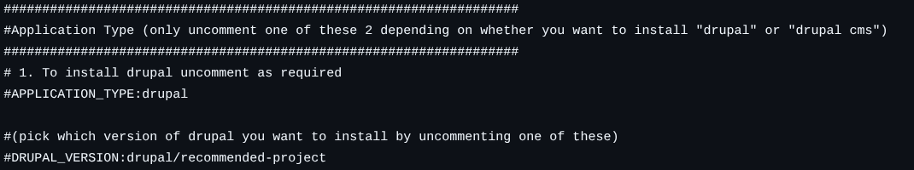
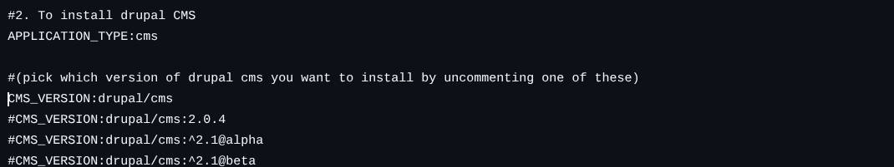
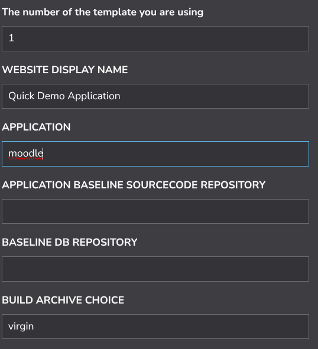
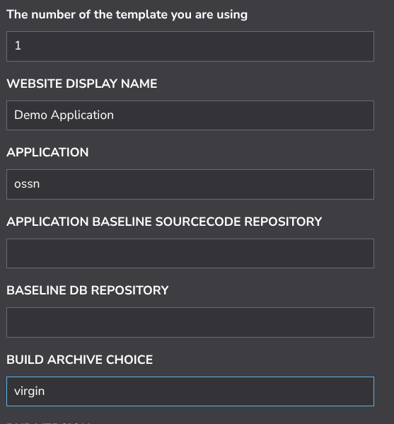
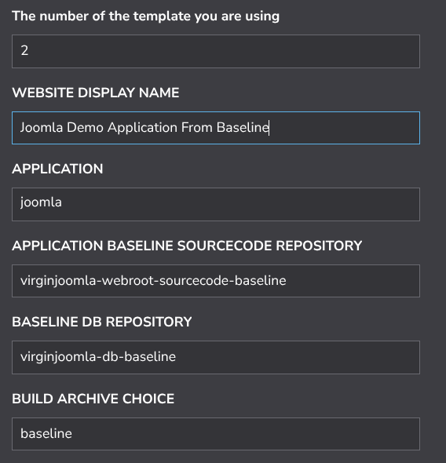
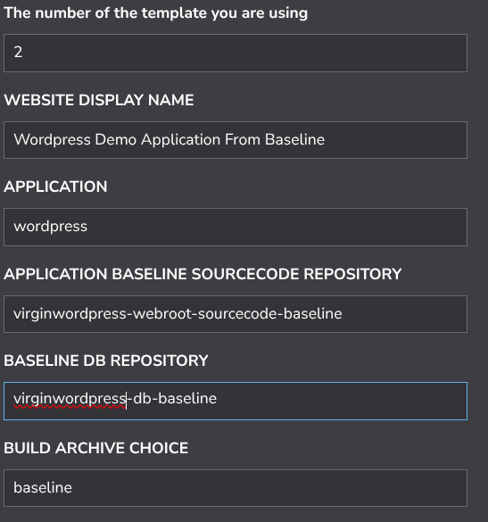
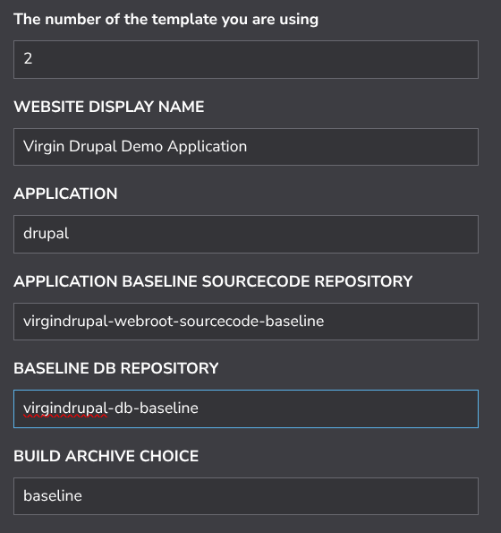
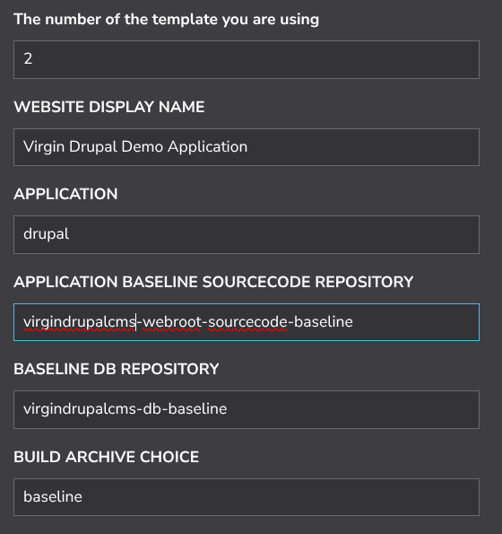
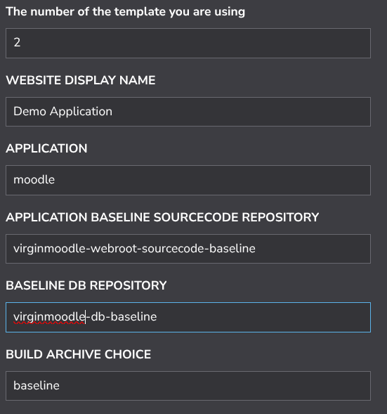

### MANDATORY PRE-REQUISITE STEPS (NEEDED BY ALL DEMOS BELOW)

Perform step 1 or 2 below according to your experience and apply the overrides to your StackScript as described below for your desired demo type before you click "Create Linode"

1. IF YOU ARE A BEGINNER, follow [here](./QuickStartDemosPrepBeginnerLevel.md)  
2. IF YOU ARE AN EXPERT (any experienced techie), follow [here](./QuickStartDemosPrepExpertLevel.md)

-------------------------  

### Joomla quick demos

Once you have performed the mandatory steps above you can action specific demos by overriding the mentioned settings in the StackScript before you deploy it. By overriding different settings as described below, you will deploy different application types using the same StackScript. 

### Demo 1 (StackScript overrides for a virgin installation of the Joomla CMS)  

Set these fields of your StackScript as shown to deploy a copy of Joomla. The rest of the "Advanced Settings" can be set with their default values. You will need to set password, vpc, firewall and so on at the bottom of the script before you click "Create Linode". 

 

Go to the URL of your virgin Joomla installation in my case:

>     https://www.nuocial.uk

The Default username is "adt-webmaster" and the default password is the "ISGYNS2RXBR0"

---------------------------

### Demo 2 (StackScript overrides for a virgin installation of the Wordpress CMS)   

Set these fields of your StackScript as shown to deploy a copy of Wordpress. The rest of the "Advanced Settings" can be set with their default values. You will need to set password, vpc, firewall and so on at the bottom of the script before you click "Create Linode". 

 

Go to the URL of your virgin Wordpress installation in my case:

>     https://www.nuocial.uk

The Default username is "adt-webmaster" and the default password is the "ISGYNS2RXBR0"

---------------------------

### Demo 3 (StackScript overrides for a virgin installation of Drupal) 

Set these fields of your StackScript as shown to deploy a copy of Drupal. The rest of the "Advanced Settings" can be set with their default values. You will need to set password, vpc, firewall and so on at the bottom of the script before you click "Create Linode". 

 

Go to the URL of your virgin Wordpress installation in my case:  

>     https://www.nuocial.uk

The Default username is "adt-webmaster" and the default password is the "ISGYNS2RXBR0"

Advanced: 

NOTE: If you are interested in deploying Drupal CMS you need to fork the toolkit repositories and set the infrastructure repositories to your fork in the Stackscript rather than wintersys-dev and change the application descriptor for drupal in your fork to deploy drupal CMS

The application descriptor is at 

>     ${BUILD_HOME}/application/cms/drupal/descriptor.dat

Then to deploy "drupal CMS" you need to follow the exact same steps you just just followed for drupal but because you commented drupal and uncomented drupal cms in the descriptor, drupal CMS will be installed.

------------------
   
------------------
 
---------------------------

### Demo 4 (StackScript overrides for a virgin installation of the Moodle CMS)  

Set these fields of your StackScript as shown to deploy a copy of Moodle. The rest of the "Advanced Settings" can be set with their default values. You will need to set password, vpc, firewall and so on at the bottom of the script before you click "Create Linode". 

 

Go to the URL of your virgin Moodle installation in my case:

>     https://www.nuocial.uk

The Default username is "adt-webmaster" and the default password is the "ISGYNS2RXBR0"

---------------------------

### Demo 5 (StackScript overrides for a virgin installation of Open Source Social Network)

Set these fields of your StackScript as shown to deploy a copy of OSSN. The rest of the "Advanced Settings" can be set with their default values. You will need to set password, vpc, firewall and so on at the bottom of the script before you click "Create Linode". 

 

Go to the URL of the installation URL for OSSN in my case:

>     https://www.nuocial.uk/installation/index.php

Fill in the form with your username and password that you desire as well as the other details and then you should be able to login.

--------------------------------------------
--------------------------------------------

###Deploying virgin versions of the applications from baselined repositories.   

I put this here to show you how you can set up a baseline for your application type where you have installed a set of base plugins or extensions and repeatedly deploy that baseline an infinite number of time. As an example under the Wordpress installation I installed "wp-smtp-mail" and if you look you will see that that is available for you by default when you install the Wordpress baseline from the below and you can do the same thing with as many plugins as you like. I will provide more detailed examples later on where you can have whole bespoke social networks baselined and installable an infinite number of times. 

### Demo 6 (StackScript overrides for a virgin installation of the Joomla CMS from a baselined repository)  

 

Wait for the application install to have been completed and available at:

>      https://<dns-url>

The Default username is "adt-webmaster" and the default password is the "ISGYNS2RXBR0"

To deploy a Postgres based virgin version of joomla change the values in your Stackscript of 

1. "APPLICATION BASELINE SOURCECODE REPOSITORY"

  >     virginjoomlapostgres-webroot-sourcecode-baseline

2. "BASELINE DB REPOSITORY"

  >     virginjoomlapostgres-db-baseline

-----------------

### Demo 7 (StackScript overrides for a virgin installation of the Wordpress CMS from a baselined repository)  

 

Wait for the application install to have been completed and available at:

>      https://<dns-url>

The Default username is "adt-webmaster" and the default password is the "ISGYNS2RXBR0"

NOTE: notice the presence of "WP Mail SMTP" as built in to the baseline

-----------------

### Demo 8 (StackScript overrides for a virgin installation of the Drupal from a baselined repository)  

 

Wait for the application install to have been completed and available at:

>      https://<dns-url>

The Default username is "adt-webmaster" and the default password is the "ISGYNS2RXBR0"

-----------------

### Demo 9 (StackScript overrides for a virgin installation of the Drupal CMS from a baselined repository)  

 

Wait for the application install to have been completed and available at:

>      https://<dns-url>

The Default username is "adt-webmaster" and the default password is the "ISGYNS2RXBR0"

To deploy a Postgres based virgin version of drupal change the values in your Stackscript of 

1. "APPLICATION BASELINE SOURCECODE REPOSITORY"

  >     virgindrupalpostgres-webroot-sourcecode-baseline

2. "BASELINE DB REPOSITORY"

  >     virgindrupalpostgres-db-baseline

--------------------------------------

### Demo 9 (StackScript overrides for a virgin installation of the Moodle CMS from a baselined repository) 

 

Wait for the application install to have been completed and available at:

>      https://<dns-url>

The Default username is "adt-webmaster" and the default password is the "ISGYNS2RXBR0"

To deploy a Postgres based virgin version of moodle change the values in your Stackscript of 

1. "APPLICATION BASELINE SOURCECODE REPOSITORY"

  >     virginmoodlepostgres-webroot-sourcecode-baseline

2. "BASELINE DB REPOSITORY"

  >     virginmoodlepostgres-db-baseline
