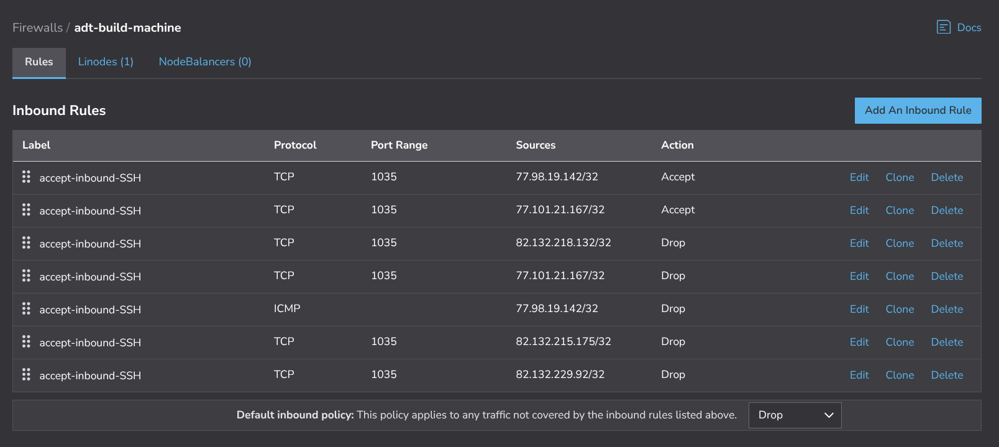
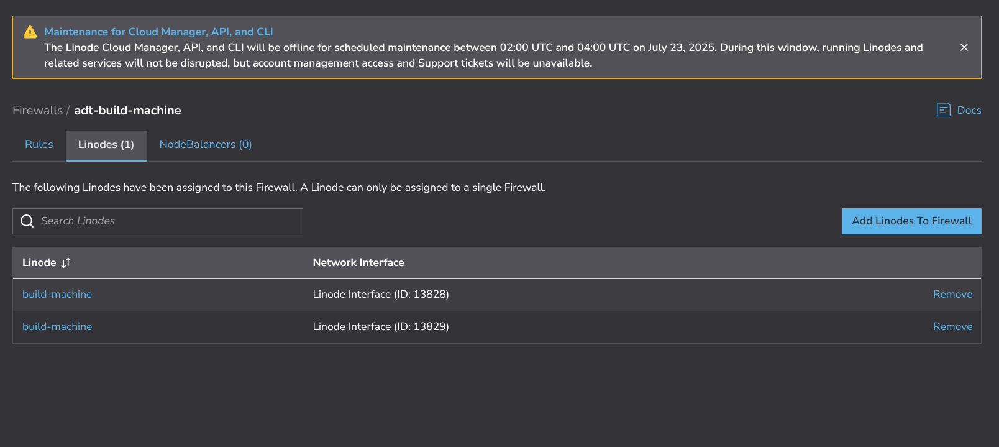

#### CONTROLLING ACCESS BY SSH TO THE BUILD MACHINE

I allow you to control which IP addresses can access your build machine by providing a mechanism where the OS firewall (ufw or iptables) can be configured to allow specific IP addresses. In the below description is an outline of how this can be done. You can also allow and deny IP addresses access to your build machine using the cloud native firewall of your VPS provider. Having a cloud native firewall and the OS firewall both controlling access to your build machine is the Fort Knox solution because you can control access to a list of say three authorised IP addresses in both your cloud native firewall and your OS firewall. This tight double firewalling might be overkill for you and if you want the most manageable solution I suggest that you either set 

>     export LAPTOP_IP="0.0.0.0/0"

for your OS firewall following the steps outlined below which will mean the OS firewall will accept connections from any ip address and you can then restrict access by specific IPs using the GUI system of your cloud native firewall.  So, in your cloud native firewall provided by your VPS cloudhost you can allow, for example IP addresses 154.43.3.22/32, 175.33.23.56/32 and 145.32.51.12/32 and that will mean that only those IP addresses will be allowed to connect to your build machine. What that means is that you can easily alter the list of IP addresses which can access your build machine over SSH simply through your VPS provider's firewall GUI system. And so when someone on your team needs a different IP address to be allowed access to the build machine you can easily update the GUI and they will have access without you having to contend with updating the OS firewall as well which is fine if you are just a single developer and want you infrastructure Fort Knoxed, but if there is more than one of you that requires access to the build machine you will likely want to have a simple way to update the allowed IP list just using the GUI system of your cloudhost. Anyway explained below is the full lowdown on how to use the protections that are built in to fortify the build machine because it has your most sensitive data on it and is a way in to your system from the outside world. Of course if all of this is too much faff and you aren't so bothered as some people are about having everything tied down you can simply allow connections from any IP addresses over SSH by being IP permissive in the OS firewall and the cloud native firewall safe in the knowledge that fail2ban is in place and public private encryption keys are in place also. If there's more than just you working with the build machine  then you yourself will have to take steps to provide access for your developer(s) private ssh keys. 

For each developer they should generate (on their local machine) their keypair using 

>     ssh-keygen -t <algorithm>

Then they need to securely give you the contents of their public key (id_<algorithm>.pub) into ~/.ssh/authorized_keys on your build machine. If you redeploy the machine (in other words, take your infrastructure offline and rebuild it) then you will need to have kept a list of all the public keys that you have allowed access through and re-add them to the newly provisioned build machine once it is online. The "secure" part of your obtaining your developers public key is essential because if you install a public key that has originated from a trojan source then that trojan's private key will pair with the public key you are installing and that leaves your system potentially wide open. It's left to you to figure out how you want to securely exchange the asymmetric key-pairs that grant access to your system. 

#### NATIVE FIREWALLING  

Following these steps will activate/confgure the UFW firewall on your build machine. It is recommended that you use your cloud provider (currently one of Digital Ocean, Linode, Exoscale or Vultr) to create a native firewall named "adt-build-machine" attach your build machine to it and allow the most restrictive set of client (laptop) ip addresses through it to your build machine that you can. This native firewall should most likely only allow the SSH port that you have configured for use when you connect to your build machine and in this way your build machine which will have all your security credential goodies is "double firewalled" with both UFW and your cloudhosts native firewall. If there's a problem with one, the other should still be there. Any time you want to allow a new laptop IP address, if for example, you connect from your office machine rathet than your home machine for the first time, then you will need to remember to manually reconfigure your native firewall as well as following the steps below to have your build machine's firewall allow an additional laptop to connect through to the build machine. Having double firewalling like this is as secure as I can make it with my level of expertise.  

**MAX SECURITY** in order to have maximum security for your build machines what you can do if you have applied a native firewall from your provider is to deny access to your SSH port at all times except when you are actively using the build machine. In other words, if you want to login to your build machine from a particular laptop you visit the GUI system of your cloudhost and use it to "allow" that IP address and when you have finished using the build machine you set access for that IP address to "deny" and in that way you are as tight as is possible because the ssh port is firewalled off at all times except when in active use from a particular IP address that you own. 

Here is an example for the Linode firewall. You can see that all IP addresses that I have allowed access to the build machine from are set to a deny state except the one I am currently accessing from. When I have finished with the build machine that IP address can also be set to "deny" and if I want to access the build machine from another one of my ip addresses I set that IP address to allow during access and then back to deny once my work is complete. 

List of IP addresses allowed and denied (you should set your specific laptop ip to allow when you  start work and deny when you finish work). 

The interfaces that the firewall "adt-build-machine" applies to 

-------------------------

#### Quick Method

You will need to already have access to your build machine to be able to use this method in order to add secondary allowed ip addresses. You might want to do this if you already have access to the build machine and you want to grant access to your trusted colleague's ip address as well. 

You can use the this script:  

>     ${BUILD_HOME}/services/security/firewall/AdjustBuildMachineFirewall.sh

to adjust access to your build machine or you can use the manual process described below, if you need to.

Now manually review the native firewall for your provider called "adt-build-machine" with your cloudhost, make sure your build machines is has this native firewall active and allow the additional IP address through the GUI also. 

-----------------------------------

#### Long method

This is what you have to do if you don't have access to your build machine or you could use the "console" of your cloudhost provider to go onto your build machine and then use the "quick method" above. 

1. Install S3CMD on your laptop/desktop and configure it so it can access your S3 compatible object store for your cloudhost.  
  
2. Look for the correct bucket in your datastore with the nomenclature:

>      s3://authip-adt-allowed<unique-identifier>

For example:

>      s3://authip-adt-allowed-92-91-154-22

where the unique identifier is based on the ip address of the current build machine. 

3. Edit a file (authorised-ips.dat) on your laptop and on separate lines put the ip addresses of each machine you want to grant access rights to your build machine to taking special care to include your own laptop's IP address. So, if your laptop ip address is 111.111.111.111 and your colleagues laptop ip address is 222.222.222.222 then your file authorised-ips.dat will look like:  
   
>      111.111.111.111  
>      222.222.222.222  
   
4. Upload this file to your s3 

>     /usr/bin/s3cmd put authorised-ips.dat s3://s3://authip-adt-allowed-92-91-154-22/authorised-ips.dat. 
   
The file must be named that precisely for the build machine to pick it up and reconfigure or tighten the firewall. You can grant and revoke access to different ip adresses by reuploading or uploading a different authorised-ips.dat file to the correct S3 bucket. This means your build machine can't be accessed from any ip address except for the ones that you authorise. A bit of a process, but, once its done you are all set. Once the build machine recognises that there is a FIREWALL-EVENT and that an authorised-ips.dat file is available, only the ip addresses that are listed in the authorised-ips.dat file will be allowed to access the build-machine. If there were IP addresses that had previously been granted access but are not listed in a new "authorised-ips.dat" file, then, those previously authorised ips will now be denied access. 

When you deploy using using a user data script you will see that you are required to enter your laptop ip address so that it can be granted access to the build machine. This works well enough, but, you might want to either deploy without using our example override scripts in which case firewall tightening isn't initially built in or, your laptop IP address might change, if you use it from a different network, for example, and this would leave you potentially locked out from your build machine. So, this whole palaver is what means that you can update your bucket in your S3 datastore directly with a new ip address and the build machine will pick up that a new ip address needs to be granted access. This way you will never be locked out of your build machine by IP address. Also, as I have shown adding multiple ip addresses to your authorised-ips.dat file in your datastore you could have a team of people all in different locations who you are effectively granting access to your build machine to. You can use any S3 client from your laptop to add a new ip address to  

>     s3://authip-adt-allowed-92-91-154-22/authorised-ips.dat  

if you are ever locked out from your build machine. The build machine is then completely firewalled off accept for the specific ip addresses and ports you have granted access to. Make sure your team know this or have access to add ip addresses because if their IP changes, they will be locked out. To action the update you also need to create a file  

>     s3://authip-adt-allowed-92-91-154-22/FIREWALL-EVENT

Now review the native firewall called "adt-build-machine" with your cloudhost and allow the additional IP address through the GUI also. 

Techniques such as SSH Knocking  can be used to secure SSH ports which are accessible from the open Internet which you could use if this solution isn't appropriate for you and you want wider accessibility to your machine(s) but what I offer here is simpler than SSH knocking and if you use what I provide here strictly your SSH ports should only ever be accessible from explicit IP addresses and not from any old IP address on the Internet. 
