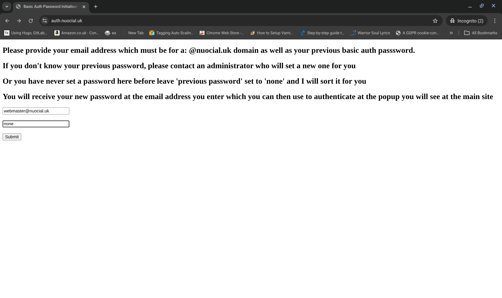

AUTHENTICATION SERVERS

Authentication servers can be deployed when you want some additional level of protection for your reverse proxy servers. Authentication servers only work when you are using reverse proxies to route requests to your main webservers. In other words, its the IP adresses of your reverse proxies that are public facing and your webservers are only accessible from your VPC.

Access Controlled by Firewall

Access Controlled by Basic Auth

Access to servers can be controlled using the basic authentication technique. You can understand basic auth [here](https://medium.com/@loydngei/understanding-basic-authentication-and-session-authentication-ff17ec692d27).

To configure for a basic auth method of authentication you need to provision authentication server(s) and set yourself up with basic auth as your authentication method. Under Linode your stackscript settings should look something like:

 

Once the servers have deployed your server dashboard should look something like:

If you try to access your main website you will be presented with the basic auth dialogue where you need to provide your email address and password to satisfy the basic auth credentials requirement. If you haven't got a basic auth password you need to generate one and you can do that by going to your authentication server (in this case, auth.nuocial.uk)

You then need to enter your email address (which has to be a nuocial.uk issued email address) and leave the second field as "none". When you click submit you will receive an email with a password. Go to your email account (check spam if need be) and obtain the password for basic auth that the system has generated for you. Go back to your main website and when the basic auth popup displays, enter your email address in my case (webmaster@nuocial.uk) and also enter the password that you received to your email address. 

If the credentials are entered correctly then you will be granted access to the website. If you ever see the basic auth popup in the future its because there is a requirement for you to generate a new password and to do this you need to provide your email address and your previous password or you can generate a new password for yourself by providing your email address and your existing password at the authentication site (in my case auth.nuocial.uk)
