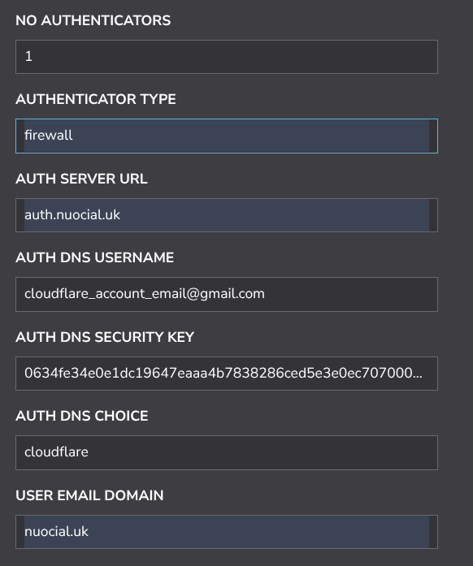
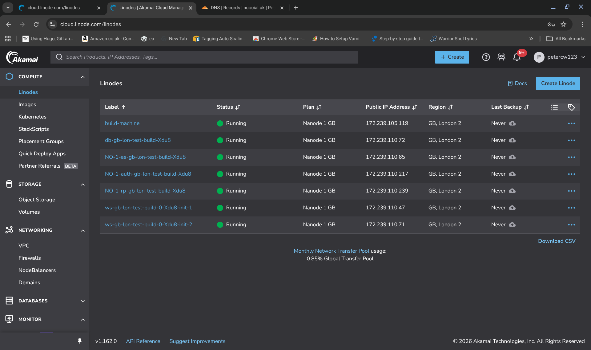
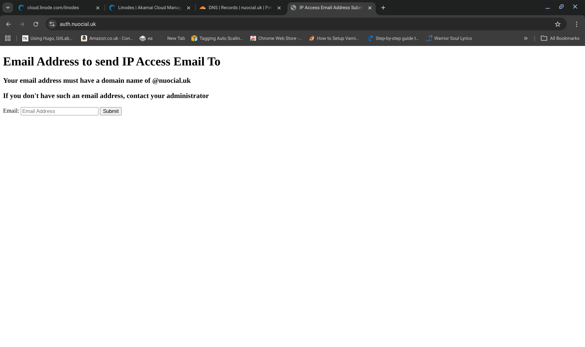
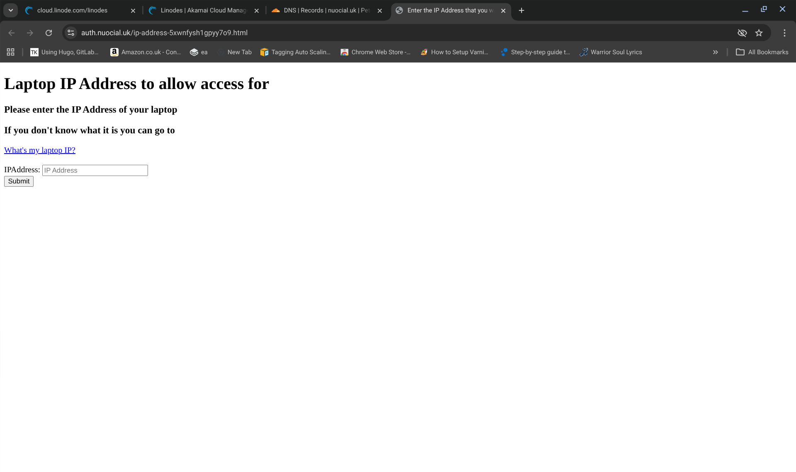
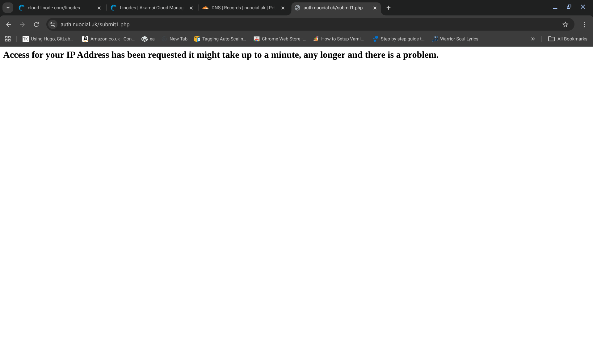
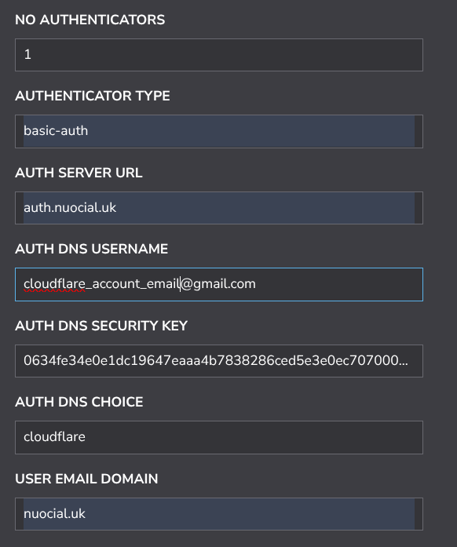
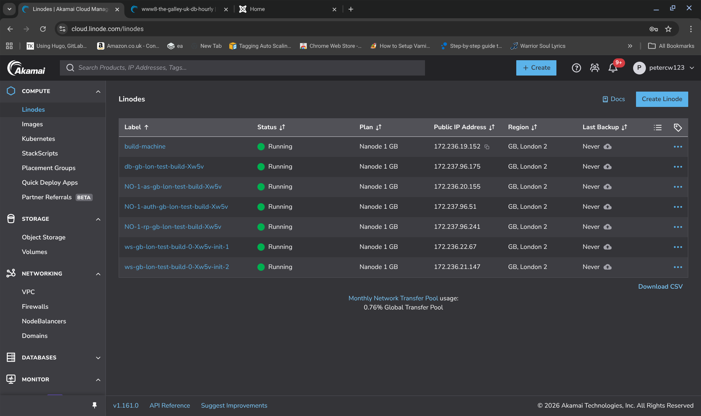
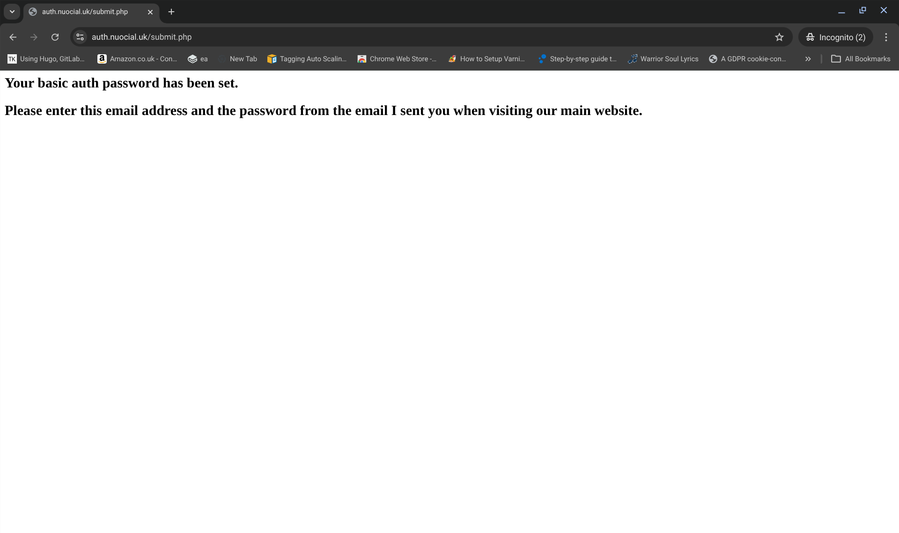
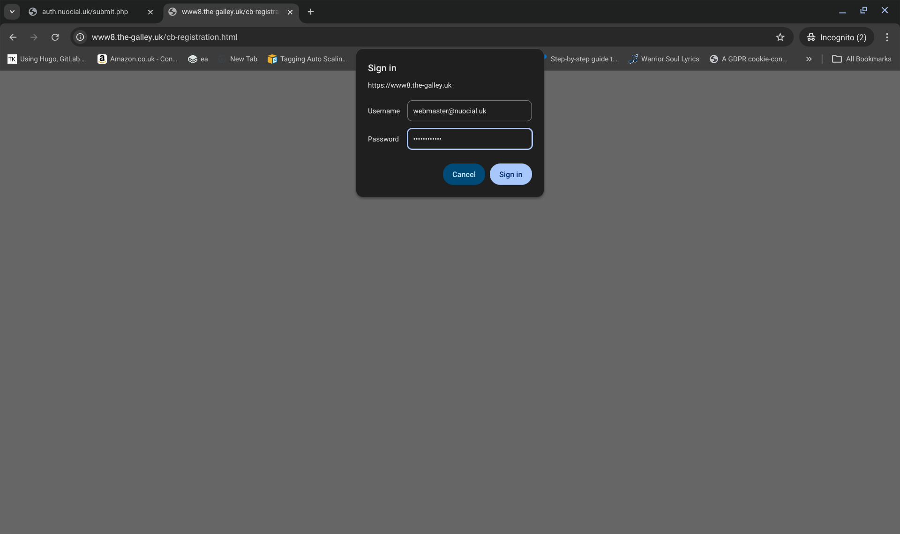

### AUTHENTICATION SERVERS

Authentication servers can be deployed when you want some additional level of protection for your reverse proxy servers. Authentication servers only work when you are using reverse proxies to route requests to your main webservers. In other words, its the IP adresses of your reverse proxies that are public facing and your webservers are only accessible from your VPC.

NOTE: you will want a separate domain for your authentication servers. So, if my "main" webservers are at a URL of "www.nuocial.uk" then I most likely want a completely separate domain "www.nuocial-auth.uk" (for example) as opposed to "auth.nuocial.uk" so that the DNS system can be completely separate from the main webservers which means that I can use, for example Cloudflare, to afford protection to my authentication servers and I can have my main server DNS systems catered for by another DNS service which have my own protection mechanisms built in. The point is, the authentication servers have to be public facing in order to bootstrap access to the system. Depending on your setup though you could invoke a many process when an administrator, for example, provides a "new user" with a bootstrap access credential which only allows access to the authentication server(s) and once the new user has access to the authentication server(s) that user can then setup their own access credentials using the authentication server(s) for access to the main web properties. 

-----------------------------------

#### Access Controlled by Firewall

The first thing you need to do if you want to govern access to your webservers using the firewall is to switch off all public accessibility to your reverse proxies and webservers in 

>     ${BUILD_HOME}/configurations/firewall.dat

I use configuration 8 in the default firewall.dat which is set as follows to make use of the firewall based authentication method. Remember with all authentication server methods you  need to be deploying reverse proxy machines the toolkit is not configured to restrict access to the webservers themselves the toolkit is designed to restict access to the reverse proxies and to require authentication to the reverse proxies and by  doing that control access to the webservers which are behind them.

Anyway to use the firewall technique, my firewall.dat file has configuration 8 uncommented which looks like this:

>     AUTHENTICATORPORTS:443|ipv4|cloudflare  
>     REVERSEPROXYPORTS:
>     AUTOSCALERPORTS:
>     WEBSERVERPORTS:
>     DATABASEPORTS:

Your stackscript should look something like this to deploy a setup that controls access using the firewall on the reverse proxy machines.

 

Once your machines are provisioned it should look similar to the following:

 

When your machines are fully provisioned if you go to your main website it will timeout so you need to gain access to your website through the authentication server. In my case this is auth.nuocial.uk (remember the authentication server will need its own domain which is different from the domain to your main website. This is so that the DNS can be controlled independently (because in my case I want to use cloudflare for by authentication server and linode DNS for my main website). If your website was called nuocial.uk you  could call your authentication server nuocialauth.uk thereby enabling you to control your nameservers independently and use different DNS providers if you want to.

So, now I go to my authentication server auth.nuocial.uk (my  main website is www8.the-galley.uk) which is confused naming perhaps but I didn't want to splash out for a specific auth domain. 

The authentication server will present you with a very basic screen (if anyone wants to improve it, right on)

 

I fill in my email address which has to be a nuocial.uk email address all other email addresses are rejected

I then get presented with a confirmation screen

I then have to find the email in my inbox (check spam perhaps) and then I click on the link and use "whatsmyip.com" to obtain the IP address of my machine and enter it into the form. Once the IP address is submitted, there is a short delay and then access will be granted to the main website. If its not granted in short order, then, there is something wrong. You may be better off using one of the other techniques rather than this one because every time your IP address changed (if you  are out and about using a mobile network, for example, the IP address of your phone often changes based on location as your phone connects to different mobile masts). This firewall technique is here because it might suit you if you have a fixed IP address and it might be useful if you are doing development work and so on or if you have  a LAN with a lot of "workers" on the lan it might (I haven't tested this) be possible to grant access to the whole lan (in other words, everyone on your lan can access the website) and nobody else. This might be useful if you wanted to restrict access to be from work only which depending on your security requirements might sometimes be necessary. 

------------------------------------

#### Access Controlled by Basic Auth

Access to servers can be controlled using the basic authentication technique. You can understand basic auth [here](https://medium.com/@loydngei/understanding-basic-authentication-and-session-authentication-ff17ec692d27).

To configure for a basic auth method of authentication you need to provision authentication server(s) and set yourself up with basic auth as your authentication method. Under Linode your stackscript settings should look something like:

 

Once the servers have deployed your server dashboard should look something like:

 

If you try to access your main website you will be presented with the basic auth dialogue where you need to provide your email address and password to satisfy the basic auth credentials requirement. If you haven't got a basic auth password you need to generate one and you can do that by going to your authentication server (in this case, auth.nuocial.uk)

 
 

You then need to enter your email address (which has to be a nuocial.uk issued email address) and leave the second field as "none". When you click submit you will receive an email with a password. Go to your email account (check spam if need be) and obtain the password for basic auth that the system has generated for you. Go back to your main website and when the basic auth popup displays, enter your email address in my case (webmaster@nuocial.uk) and also enter the password that you received to your email address. 

 

If the credentials are entered correctly then you will be granted access to the website. If you ever see the basic auth popup in the future its because there is a requirement for you to generate a new password and to do this you need to provide your email address and your previous password or you can generate a new password for yourself by providing your email address and your existing password at the authentication site (in my case auth.nuocial.uk)
